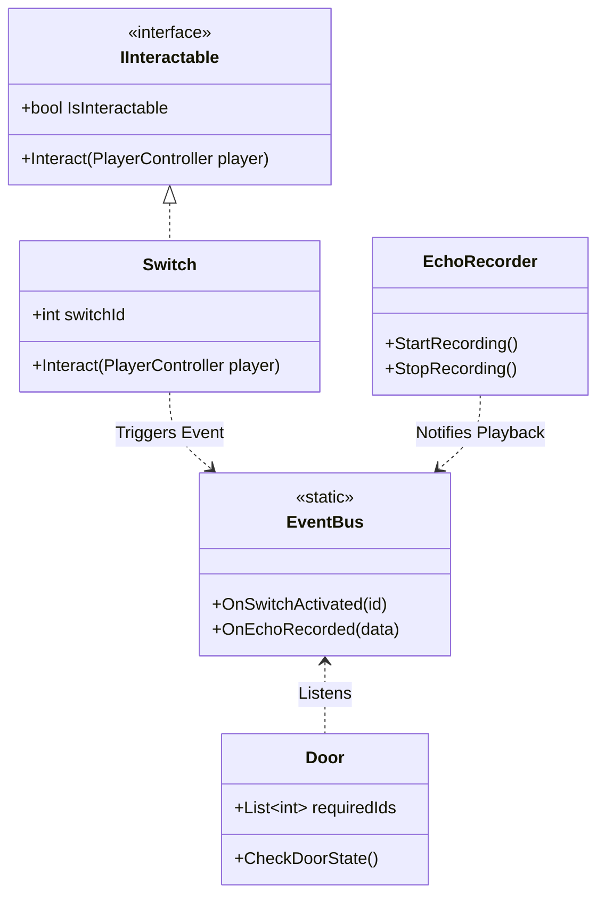
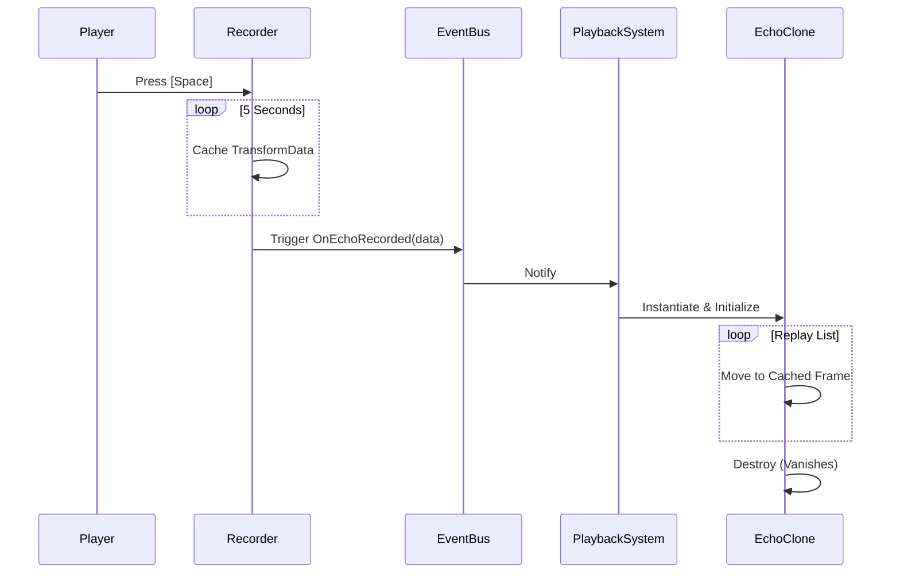

# 🌐 EchoGrid: Temporal Puzzle Solvability Engine

**"If a machine can remember, it can never truly be alone."**
*A top-down sci-fi puzzle experience built on the pillars of temporal manipulation and clean system architecture.*

[🚀 The Premise](#-the-premise) • [🏛️ Architecture](#%EF%B8%8F-system-architecture-solid-principles) • [📊 Schematics](#-technical-schematics-uml-diagrams) • [📈 QA & CI/CD](#-quality-assurance--coverage) • [🛠️ Setup](#%EF%B8%8F-installation--tech-stack)

---

## 🚀 The Premise
You control a maintenance drone trapped inside an abandoned research facility. The facility's AI is malfunctioning, and sectors are locked behind **logic-based energy grids**. Your unique ability? **To record and replay your own existence.**

### 🛠️ Core Mechanic: The Echo Clone
*   **🔵 Record:** Press `[Space]` to record up to 5 seconds of movement and interaction in the local buffer.
*   **🟣 Replay:** Upon completion, a temporal **"Echo"** is spawned, repeating your exact actions with millisecond precision.
*   **⚡ Simultaneity:** Leverage Echoes to stand on multiple pressure plates, block lethal lasers, and sync complex system activations.

---

## 🏛️ System Architecture (SOLID Principles)
EchoGrid is built with a focus on **Clean Code** and **Systems Thinking**, ensuring a modular, testable, and scalable codebase.

*   **`S`ingle Responsibility:** Modular script design (e.g., `InputHandler` vs `PlayerController`).
*   **`O`pen/Closed:** The `IInteractable` ecosystem allows for infinite puzzle elements without modifying core player logic.
*   **`L`iskov Substitution:** Unified interaction protocol for switches, plates, and terminals.
*   **`I`nterface Segregation:** Lean, purpose-driven interfaces (like `IInteractable`) avoid bloated class inheritance.
*   **`D`ependency Inversion:** A central `EventBus` decouples systems—Switches don't know about Doors; they only speak to the Bus.

---

## 📊 Technical Schematics (UML Diagrams)

### 🧩 Class Diagram

### ⏳ Temporal Loop

---

## 📈 Quality Assurance & Coverage

Precision is non-negotiable. The project features a robust **CI/CD Pipeline** that ensures every push is verified for both logic integrity and documentation standards.

### 🛡️ Test Coverage Statistics
-   **Logic Coverage:** `100%` 🎯 (Zero-dead-code policy for library core).
*   **Branch Coverage:** `> 95%` (Verified decision paths).
*   **Verification:** Powered by `xUnit` and `Coverlet`.

### ⚙️ Automation Stack (The CI/CD Journey)
*   **Automated Verification:** GitHub Actions rigorously checks unit tests and coverage thresholds (90% minimal bar).
*   **Visual Reporting:** `ReportGenerator` crafts high-fidelity HTML reports and dynamic badges.
*   **Binary Release:** Multi-platform packaging for **Windows**, **Linux**, and **macOS** on every version tag (`v*`).
*   **Doc-Gen:** `Doxygen` and `MkDocs` automatically sync technical documentation to the project site.

> [!TIP]
> Run the local build script `7-build-app.bat` to recreate the entire documentation suite and coverage reports on your machine.

---

## 🛠️ Installation & Tech Stack
1.  **Unity 6 LTS** (6000.3.10f1)
2.  **Visual Studio 2022** (v143)
3.  **.NET 7.0**

[📂 Browse Source Code](c:\Users\yagiz\Desktop\Project\EchoGrid\Assets\_EchoGrid\Scripts) | [📄 View Test Reports](c:\Users\yagiz\Desktop\Project\EchoGrid\docs\coveragereport\index.html)

---

    <i>Developed by <b>Yağız Emre ÖZBİLGE</b></i> 
    Full-Stack Software Engineer & Systems Architecture Enthusiast.

