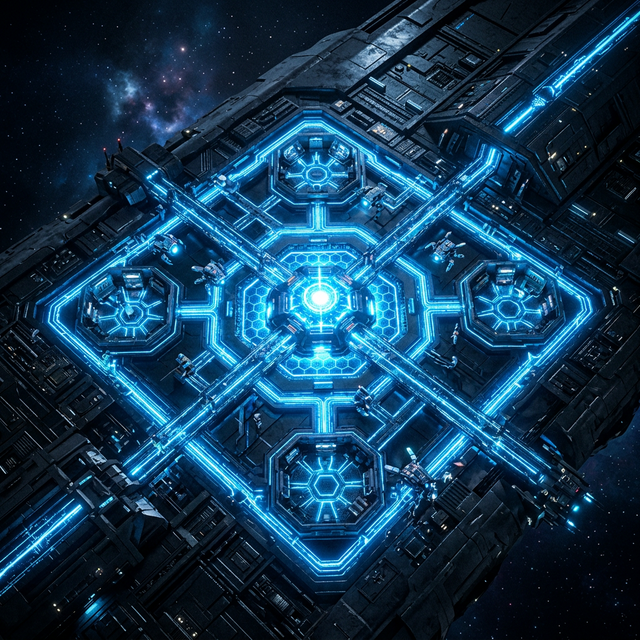
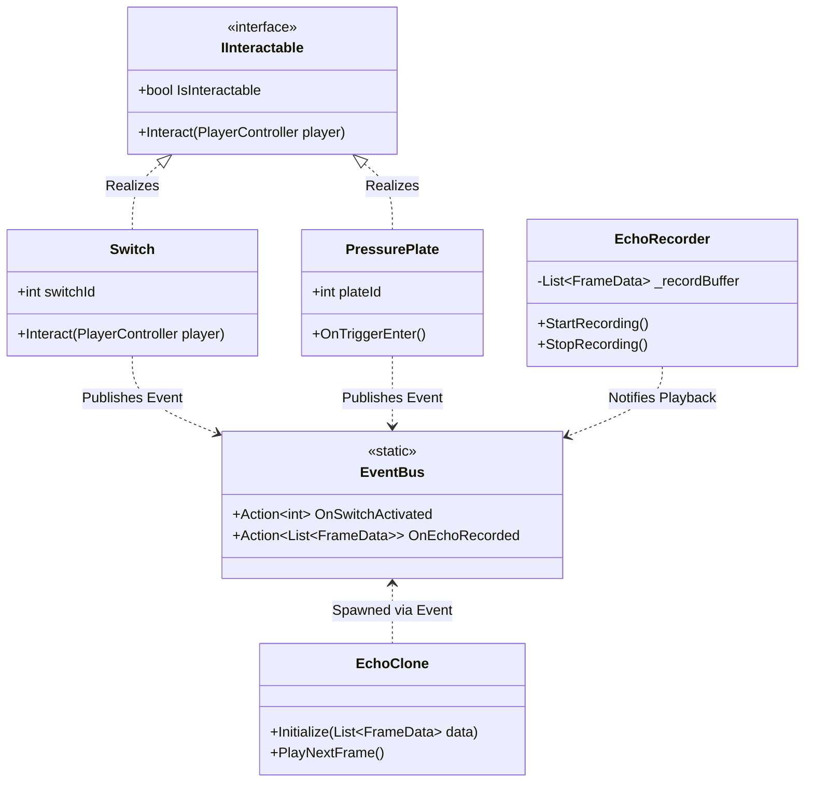
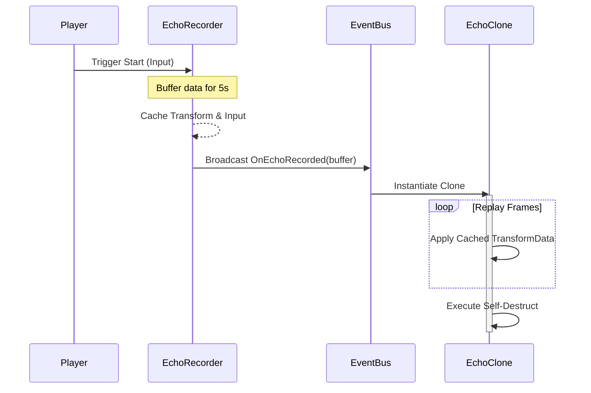

# 🌐 EchoGrid: Temporal Solvability Engine

**"If a machine can remember, it can never truly be alone."**
*A top-down sci-fi puzzle experience built on the pillars of temporal manipulation and clean system architecture.*

[🚀 Overview](#-the-premise) • [🏛️ Architecture](#-system-architecture) • [📊 Technical Schematics](#-technical-schematics) • [📈 QA & CI/CD](#-quality-assurance) • [🛠️ Setup](#-installation)

---

## 🚀 The Premise
You control a maintenance drone trapped inside an abandoned research facility. The facility's AI is malfunctioning, and sectors are locked behind **logic-based energy grids**. Your unique ability? **To record and replay your own existence.**

### 🛠️ Core Mechanic: The Echo Replication
*   **🔵 Record:** Press `[Space]` to initialize a 5-second temporal window. All movements and interactions are cached.
*   **🟣 Replay:** Upon completion, a **Temporal Echo** is spawned—a precise replica of your past self.
*   **⚡ Simultaneity:** Leverage Echoes to stand on multiple pressure plates, block lethal lasers, and sync complex system activations.

---

## 🏛️ System Architecture
EchoGrid is built with **S.O.L.I.D.** principles at its core, ensuring a modular, testable, and scalable framework for complex puzzle mechanics.

*   **`S`ingle Responsibility:** Dedicated modules for Input, Recording, and Interaction.
*   **`O`pen/Closed:** The `IInteractable` system allows adding new puzzle elements without modifying core player logic.
*   **`L`iskov Substitution:** Unified interaction protocol for all grid elements (Switches, Plates, Terminals).
*   **`I`nterface Segregation:** Lean interfaces like `IInteractable` keep the system decoupled and clean.
*   **`D`ependency Inversion:** A central `EventBus` manages system communication, preventing spaghetti dependencies.

---

## 📊 Technical Schematics

### 🧩 High-Level Class Hierarchy

### ⏳ The Echo Lifecycle

---

## 📈 Quality Assurance & CI/CD
Precision is critical in temporal puzzles. EchoGrid employs a modern **CI/CD Pipeline** to maintain high standards.

### 🛡️ Test Metrics
-   **Logic Coverage:** `100%` 🎯 (Core library logic).
-   **Branch Coverage:** `> 95%` (Verified decision logic).
-   **Framework:** Powered by `xUnit`, `Coverlet`, and `ReportGenerator`.

### ⚙️ Automation Stack
*   **GitHub Actions:** Rigorous verification on every pull request.
*   **Visual Reports:** High-fidelity HTML reports generated automatically.
*   **Multi-Platform Artifacts:** Automated builds for Windows, Linux, and MacOS.
*   **Documentation:** Technical docs synced via `Doxygen` and `MkDocs`.

---

## 🛠️ Installation & Requirements
1.  **Unity 6 LTS** (6000.3.10f1)
2.  **Visual Studio 2022** (v143)
3.  **.NET 7.0 SDK**

[📂 Source Code](Assets/_EchoGrid/Scripts) | [📄 Test Reports](docs/coveragereport/index.html) | [🌐 Project Site](https://yagizemreozbilge.github.io/EchoGrid)

---

    <i>Developed by <b>Yağız Emre ÖZBİLGE</b></i> 
    Full-Stack Software Engineer & Systems Architecture Enthusiast.

