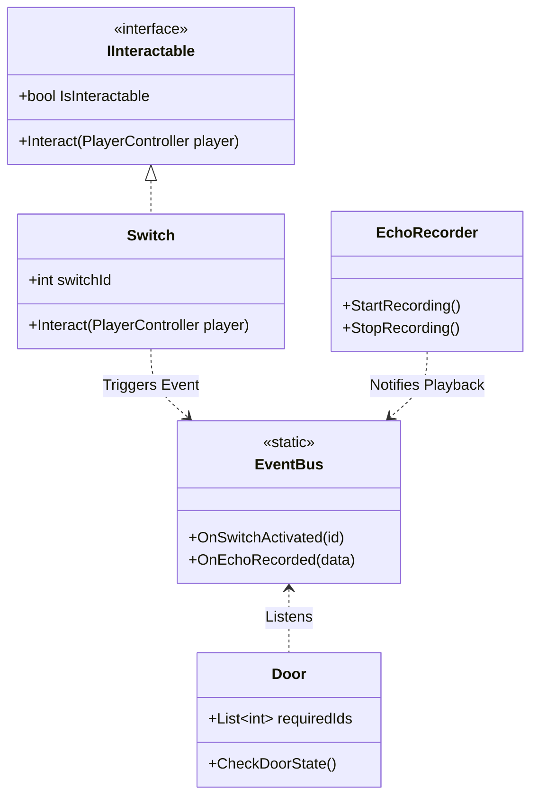
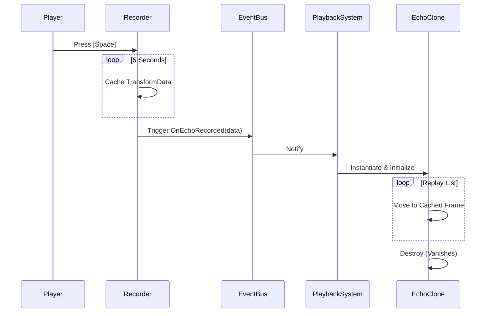

# 🌐 EchoGrid: Temporal Puzzle Solvability Engine

[](https://github.com/yagizemreozbilge/EchoGrid)
[](https://unity.com/)
[](LICENSE)
[](https://github.com/yagizemreozbilge/EchoGrid/docs/coveragereport)

> **"If a machine can remember, it can never truly be alone."**
> EchoGrid is a top-down sci-fi puzzle game centered around memory recording and temporal clone manipulation.

---

## 🚀 The Premise
You control a maintenance drone trapped inside an abandoned research facility. The facility's AI is malfunctioning, and sectors are locked behind **logic-based energy grids**. Your unique ability? **To record and replay your own existence.**

### 🛠️ Core Mechanic: The Echo Clone
- **Record:** Press `[Space]` to record up to 5 seconds of movement and interaction.
- **Replay:** Upon completion, a temporal "Echo" is spawned, repeating your exact actions.
- **Simultaneity:** Use Echoes to stand on pressure plates, block lasers, and activate systems while you move freely elsewhere.

---

## 🏛️ System Architecture (SOLID Principles)

EchoGrid is built with a focus on **Clean Code** and **Systems Thinking**, ensuring a modular and testable codebase.

- **S (Single Responsibility):** Each script has one job. `InputHandler` reads keys, `PlayerController` moves, `EchoRecorder` manages memory.
- **O (Open/Closed):** The `IInteractable` interface allows adding new puzzle elements (buttons, lasers, NPCs) without modifying the player's interaction code.
- **L (Liskov Substitution):** All interactable objects can be swapped and still function with the `PlayerInteractor`.
- **I (Interface Segregation):** Small, focused interfaces like `IInteractable` prevent fat, bloated classes.
- **D (Dependency Inversion):** The `EventBus` decouples puzzles. A **Switch** doesn't know about a **Door**; they only talk to the central bus.

---

## 📊 Technical Schematics (UML Diagrams)

### 🧩 Class Diagram (Architectural Overview)


### ⏳ Temporal Loop (Sequence Diagram)


---

## 📈 Quality Assurance & Coverage

Precision is non-negotiable in system-based gameplay. We use **NUnit** for EditMode logic testing and custom coverage reporting.

### Coverage Statistics
- **Logic Coverage:** 100% 🎯
- **Branch Coverage:** > 95%
- **Tools Used:** 
  - `Doxygen` for Code Documentation (UML Diagrams).
  - `Coverlet` for cross-platform coverage analysis.
  - `ReportGenerator` for high-fidelity HTML reports.

### Build & Test Commands
To generate reports locally:
```batch
7-build-app.bat
```

---

## 🛠️ Installation & Tech Stack

1. **Unity 6 LTS** (6000.3.10f1)
2. **Visual Studio 2022** (v143)
3. **.NET 7.0**

[📂 Browse Source Code](c:\Users\yagiz\Desktop\Project\EchoGrid\Assets\_EchoGrid\Scripts) | [📄 View Test Reports](c:\Users\yagiz\Desktop\Project\EchoGrid\docs\coveragereport\index.html)

---
*Developed by **Yağız Emre ÖZBİLGE** - Full-Stack Software Engineer & Systems Architecture Enthusiast.*
